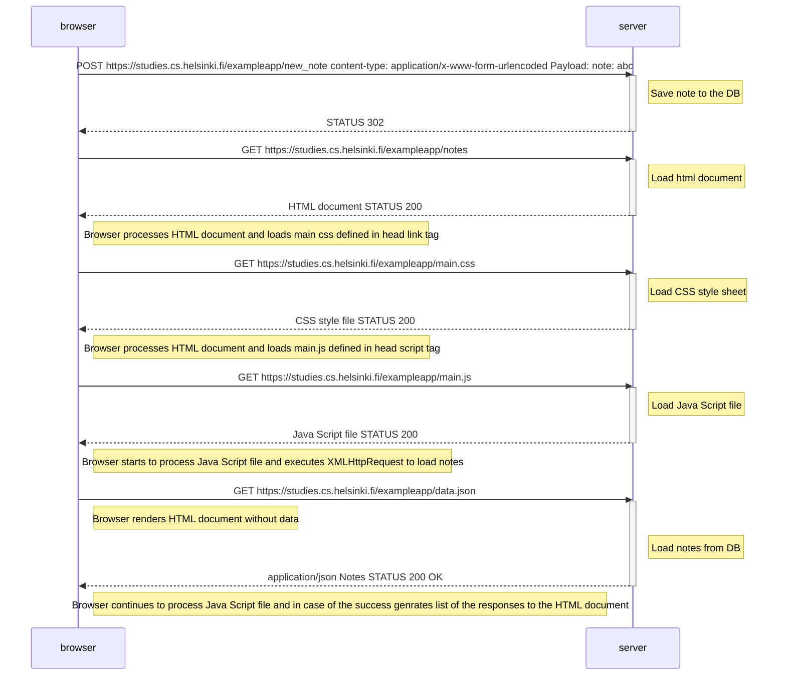

```mermaid
sequenceDiagram
    participant browser
    participant server
    
    browser->>server: POST https://studies.cs.helsinki.fi/exampleapp/new_note content-type: application/x-www-form-urlencoded Payload: note: abc
    activate server
        Note right of server: Save note to the DB
        server-->>browser: STATUS 302
    deactivate server
    

    browser->>server: GET https://studies.cs.helsinki.fi/exampleapp/notes
    activate server
        Note right of server: Load html document
        server-->>browser: HTML document  STATUS 200
    deactivate server

    Note right of browser: Browser processes HTML document and loads main css defined in head link tag

    browser->>server: GET https://studies.cs.helsinki.fi/exampleapp/main.css
    activate server
        Note right of server: Load CSS style sheet
        server-->>browser: CSS style file  STATUS 200
    deactivate server

    Note right of browser: Browser processes HTML document and loads main.js defined in head script tag

    browser->>server: GET https://studies.cs.helsinki.fi/exampleapp/main.js
    activate server
        Note right of server: Load Java Script file
        server-->>browser: Java Script file  STATUS 200
    deactivate server

    Note right of browser: Browser starts to process Java Script file and executes XMLHttpRequest to load notes

        browser->>server: GET https://studies.cs.helsinki.fi/exampleapp/data.json
    
    activate server
        Note right of browser: Browser renders HTML document without data
        Note right of server: Load notes from DB
        server-->>browser: application/json Notes  STATUS 200 OK
    deactivate server
    
    Note right of browser: Browser continues to process Java Script file and in case of the success genrates list of the responses to the HTML document
```