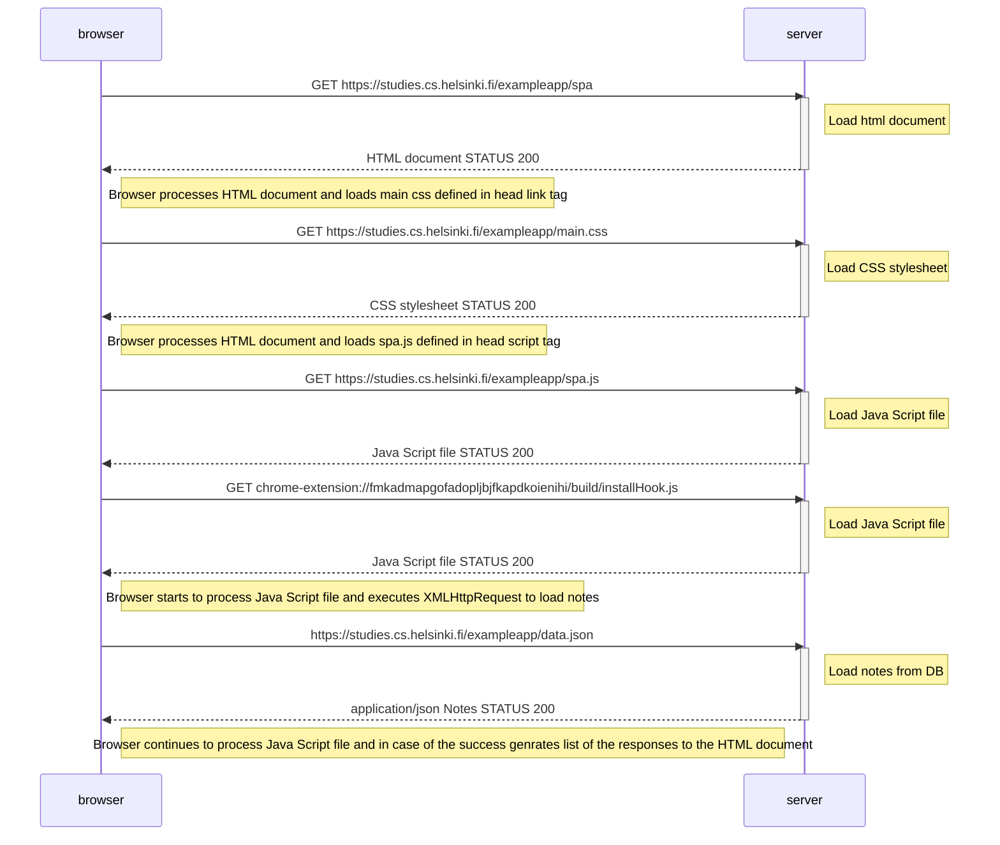

```mermaid
sequenceDiagram
    participant browser
    participant server
    
    browser->>server: GET https://studies.cs.helsinki.fi/exampleapp/spa
    activate server
        Note right of server: Load html document
        server-->>browser: HTML document  STATUS 200
    deactivate server

    Note right of browser: Browser processes HTML document and loads main css defined in head link tag

    browser->>server: GET https://studies.cs.helsinki.fi/exampleapp/main.css
    activate server
        Note right of server: Load CSS stylesheet
        server-->>browser: CSS stylesheet  STATUS 200
    deactivate server

    Note right of browser: Browser processes HTML document and loads spa.js defined in head script tag

    browser->>server: GET https://studies.cs.helsinki.fi/exampleapp/spa.js
    activate server
        Note right of server: Load Java Script file
        server-->>browser: Java Script file  STATUS 200
    deactivate server

    browser->>server: GET chrome-extension://fmkadmapgofadopljbjfkapdkoienihi/build/installHook.js
    activate server
        Note right of server: Load Java Script file
        server-->>browser: Java Script file  STATUS 200
    deactivate server

    Note right of browser: Browser starts to process Java Script file and executes XMLHttpRequest to load notes

    browser->>server: https://studies.cs.helsinki.fi/exampleapp/data.json
    activate server
        Note right of server: Load notes from DB
        server-->>browser: application/json Notes  STATUS 200
    deactivate server
    
    Note right of browser: Browser continues to process Java Script file and in case of the success genrates list of the responses to the HTML document
```
