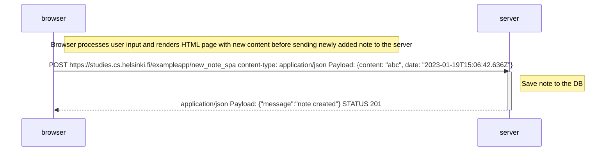

```mermaid
sequenceDiagram
    participant browser
    participant server
    
    Note right of browser: Browser processes user input and renders HTML page with new content before sending newly added note to the server

    browser->>server: POST https://studies.cs.helsinki.fi/exampleapp/new_note_spa content-type: application/json Payload: {content: "abc", date: "2023-01-19T15:06:42.636Z"}
    activate server
        Note right of server: Save note to the DB
        server-->>browser: application/json Payload: {"message":"note created"} STATUS 201
    deactivate server

```